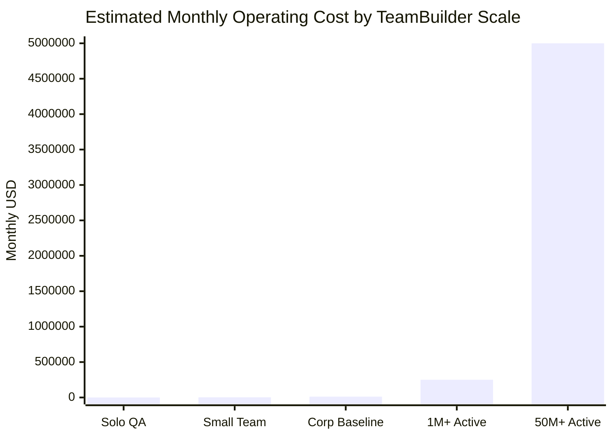

# Estimated Operating Costs

Pricing date: 2026-05-17

Status: Planning estimate, not a vendor quote

Prices change frequently. Usage-based services vary by region, traffic,
retention, bandwidth, storage, support level, and enterprise discounts. All
prices must be verified with vendor pricing calculators before purchase. User
count does not equal active usage. Registered users, monthly active users,
daily active users, and peak requests per second are different capacity
drivers. The ranges in this document are planning bands, not financial
commitments or vendor quotes.

## Current Deployment Reality

- GitHub main → Render Docker deploy → Render QA API
- Render QA API: <https://teambuilder-api-qa.onrender.com>
- Health: <https://teambuilder-api-qa.onrender.com/health>
- Readiness: <https://teambuilder-api-qa.onrender.com/health/ready>
- Octopus exists but is not the active deployment path yet.
- Render is the active QA host right now.

## Cost Summary

| Tier | Monthly Estimate | Yearly Estimate | Supports |
|---|---:|---:|---|
| Solo / current QA | $35–$150 | $420–$1,800 | Current development and lean QA |
| Small funded team | $1,200–$2,000 | $14,400–$24,000 | Small team with paid tooling and early production |
| Corporate production baseline | $5,000–$12,000+ | $60,000–$144,000+ | Serious production readiness, not hyperscale |
| 1M+ active user scale | $25,000–$250,000+ | $300,000–$3,000,000+ | High-traffic production with multiple scale layers |
| 50M+ active user scale | $500,000–$5,000,000+ | $6,000,000–$60,000,000+ | Hyperscale, multi-region, enterprise operations |

## Does the Corporate Baseline Support 1M+ Users?

No, not safely.

$5k–$12k/month is a baseline production operating budget. It may support a
small-to-medium production launch. It should not be described as enough for
1M+ active users.

A 1M registered-user product might be cheap if only a small percentage is
active. A 1M monthly-active-user product can become expensive quickly because
API requests, database writes, log ingestion, bandwidth, and support load scale
with activity.

## Scale Assumptions

| Scale | Example Assumption | Monthly API Requests | Peak Shape |
|---|---|---:|---|
| 1M registered users, low activity | 100k MAU, 100 requests/user/month | 10M | Light |
| 1M MAU, normal activity | 1M MAU, 500 requests/user/month | 500M | Serious production |
| 1M MAU, heavy activity | 1M MAU, 2,000 requests/user/month | 2B | High scale |
| 50M MAU, normal activity | 50M MAU, 500 requests/user/month | 25B | Hyperscale |
| 50M MAU, heavy activity | 50M MAU, 2,000 requests/user/month | 100B | Global-scale platform |

## Long-Term Scale Cost Model

| Cost Area | 1M+ Active Users / Month | 50M+ Active Users / Month | Notes |
|---|---:|---:|---|
| API compute | $5k–$30k+ | $100k–$750k+ | Autoscaled app services, containers, or Kubernetes |
| Database primary + replicas | $10k–$100k+ | $200k–$2M+ | Azure SQL Hyperscale/Business Critical, sharding, replicas, backups |
| Cache layer | $1k–$15k+ | $50k–$500k+ | Redis or equivalent; required for hot reads and rate limiting |
| CDN / WAF / edge routing | $500–$20k+ | $25k–$500k+ | Azure Front Door, CDN, WAF, bandwidth |
| Observability/logging/APM | $3k–$50k+ | $100k–$1M+ | Often one of the biggest surprise costs |
| Queue/background processing | $500–$15k+ | $25k–$250k+ | Jobs, notifications, imports, async workflows |
| Object/blob storage | $100–$10k+ | $10k–$250k+ | Avatars, media, exports, logs, backups |
| Secrets/security/compliance | $500–$20k+ | $20k–$500k+ | Key Vault, SIEM, vulnerability scanning, audits |
| CI/CD/release tooling | $500–$10k+ | $5k–$100k+ | GitHub, Octopus, runners, environments |
| Developer/API tooling seats | $1k–$15k+ | $10k–$100k+ | GitHub, Copilot, Postman, Docker, IDEs |
| Support/incident tooling | $500–$20k+ | $25k–$500k+ | PagerDuty/Opsgenie, status page, alerting |
| Total estimate | $25k–$250k+/month | $500k–$5M+/month | Excludes engineering salaries and custom enterprise contracts |

## Long-Term Cost Graph

Markdown fallback:

- Solo QA: $35–$150/month
- Small Team: $1,200–$2,000/month
- Corporate Baseline: $5,000–$12,000+/month
- 1M+ Active Users: $25,000–$250,000+/month
- 50M+ Active Users: $500,000–$5,000,000+/month

## Environment Breakdown

| Environment | Purpose | Monthly Estimate | Notes |
|---|---|---:|---|
| Development | Local dev, feature testing | $0–$250 | Mostly local tools and shared subscriptions |
| QA | Render QA, Entra, Postman smoke testing | $50–$500 | Current active hosted environment |
| Staging | Production-like validation | $500–$5,000+ | Should mirror production architecture at smaller scale |
| Production baseline | First real production launch | $1,000–$12,000+ | Not enough for guaranteed 1M+ active users |
| 1M+ active production | High-scale production | $25,000–$250,000+ | Requires cache, DB scaling, monitoring, DR planning |
| 50M+ active production | Global-scale platform | $500,000–$5,000,000+ | Requires multi-region architecture and dedicated platform operations |

## Architecture Changes Needed Before 1M+ Users

- Azure SQL Hyperscale or equivalent scaling plan
- Read replicas or read scaling
- Redis/cache layer
- CDN/WAF/edge routing
- Rate limiting
- Queue/background workers
- Blob/object storage for media
- Observability sampling and log retention controls
- Database migration governance
- Backups and disaster recovery
- Load testing
- Performance budgets
- Incident response and on-call process

## Architecture Changes Needed Before 50M+ Users

- Multi-region deployment
- Database partitioning/sharding strategy
- Global traffic management
- Regional caches
- Event-driven architecture for heavy workflows
- Dedicated analytics pipeline
- Aggressive telemetry sampling
- Dedicated SRE/platform operations
- Security review, compliance, and abuse prevention
- Enterprise support agreements

## Known Pricing Assumptions

These are examples to re-check before purchase.

- Render Pro workspace: $25/month flat plan, plus usage and compute
- Render Scale workspace: $499/month flat plan, plus usage and compute
- Render Web Services:
  - Free: $0/month
  - Starter: $10/month
  - Standard: $32/month
  - Pro: $135/month
  - Pro Plus: $250/month
  - Pro Max: $550/month
  - Pro Ultra: $1,100/month
- GitHub Team: $4/user/month
- GitHub Enterprise: $21/user/month
- GitHub Copilot Business and Enterprise should be verified from GitHub before
  purchase because Copilot pricing and usage billing can change.
- Postman Team: $19/user/month billed annually
- Docker Team: $15/user/month annually or $16/user/month monthly
- Docker Business: $24/user/month annually
- Octopus Cloud Free: $0/year
- Octopus Professional: $104/project/year
- Octopus Enterprise: $156/project/year
- Microsoft Entra ID P1: $6/user/month
- Microsoft Entra ID P2: $9/user/month
- Microsoft Entra Suite: $12/user/month
- Azure Front Door Standard base fee: about $35/month
- Azure Front Door Premium base fee: about $330/month
- Azure Key Vault standard operations: about $0.03 per 10,000 operations
- Azure Monitor: usage-based; log ingestion and retention are major cost drivers
- Azure SQL: estimate with Azure Pricing Calculator before purchase because
  tier, replicas, storage, and region dominate cost

## What Costs Are Not Included

- Engineering salaries
- Customer support staff
- Legal and compliance
- Security audits and penetration testing
- Marketing
- Sales operations
- Enterprise support contracts unless separately negotiated
- Taxes
- Marketplace fees
- Payment processing
- SMS/email notification volume

## Recommended TeamBuilder Cost Roadmap

### Phase 1

- Render QA stabilization
- Postman/Entra smoke testing
- QA DB/readiness

### Phase 2

- Baseline production
- Monitoring and backups
- Custom domains
- Basic incident process

### Phase 3

- 1M active user readiness
- Load testing
- Cache and read scaling
- DB scale planning
- Observability cost controls

### Phase 4

- 50M active user architecture
- Multi-region
- Sharding
- SRE/process maturity

## GitHub Discussion Draft

**Title:** Estimated TeamBuilder Operating Costs and Long-Term Scale Planning

**Category:** DevOps, Environments, and Deployment Strategy

**Labels:**

- area:devops
- area:database
- area:github-actions
- help wanted

**Ask for feedback on:**

- Whether the cost assumptions are realistic
- Whether 1M+ active users should target Azure SQL Hyperscale, another SQL
  strategy, or a split read model
- Whether 50M+ active users requires multi-region and sharding
- Whether Render remains suitable for production or Azure/Kubernetes should be
  planned
- What hidden costs are missing
